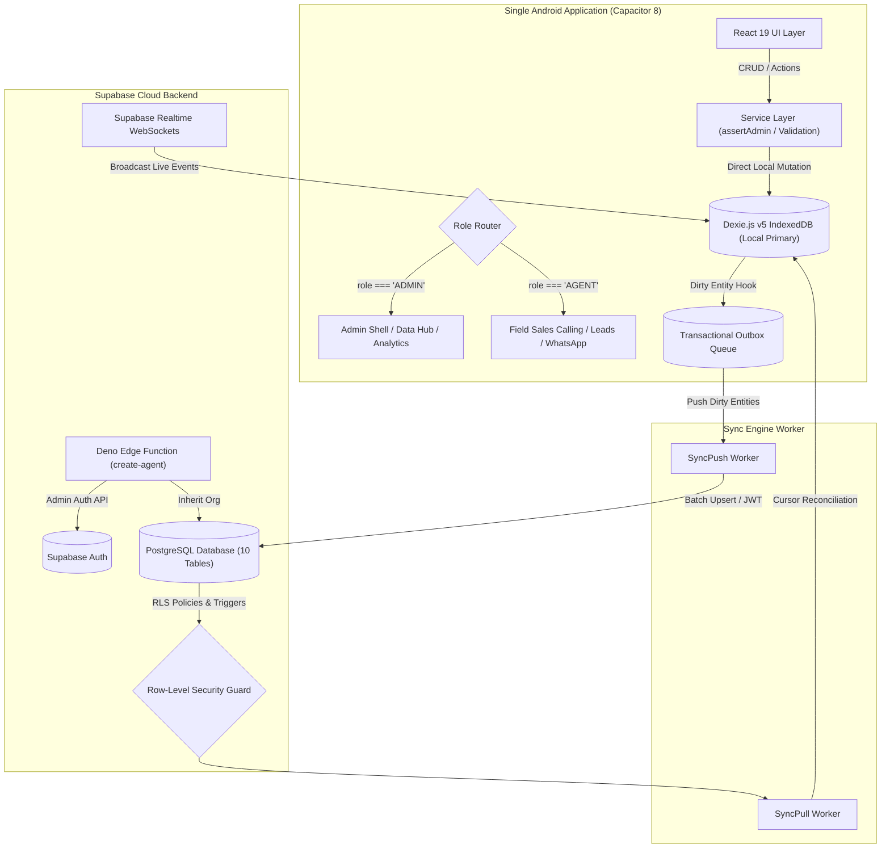

# Amaratv Krishi Field Sales CRM (v2.0.0)

<div align="center">


**Enterprise-Grade, Offline-First Mobile CRM for Lucknow Nutrition & Wellness B2B Sales**

[](./tests)
[-blue?style=flat-square&logo=typescript)](./tsconfig.json)
[](./android)
[](./vite.config.ts)
[](./package.json)
[](./capacitor.config.ts)
[-yellow?style=flat-square)](./src/db)
[-3ECF8E?style=flat-square&logo=supabase)](./supabase)

</div>

---

## Table of Contents

1. [Executive Overview & Business Context](#1-executive-overview--business-context)
2. [Core Architectural Invariants](#2-core-architectural-invariants)
3. [Role & Authorization Matrix](#3-role--authorization-matrix)
4. [Complete Feature Deep Dive](#4-complete-feature-deep-dive)
   - [Lead Pipeline & Lifecycle Management](#41-lead-pipeline--lifecycle-management)
   - [Native Telephony & Talk-Time Anti-Fabrication](#42-native-telephony--talk-time-anti-fabrication)
   - [WhatsApp Outreach & Catalogue Distribution](#43-whatsapp-outreach--catalogue-distribution)
   - [Follow-ups & Native Local Notifications](#44-follow-ups--native-local-notifications)
   - [Bulk Lead Assignment Engine](#45-bulk-lead-assignment-engine)
   - [Admin Central Data Management Hub](#46-admin-central-data-management-hub)
   - [Executive Dashboard & Live Activity Ticker](#47-executive-dashboard--live-activity-ticker)
   - [7-Category Analytics & CSV Export](#48-7-category-analytics--csv-export)
   - [Disaster Recovery, Snapshot & LWW Backup](#49-disaster-recovery-snapshot--lww-backup)
   - [Production Hardening & Error Boundary](#410-production-hardening--error-boundary)
5. [System Architecture & Data Flows](#5-system-architecture--data-flows)
6. [Database Schemas (Dexie v5 & Supabase PostgreSQL)](#6-database-schemas-dexie-v5--supabase-postgresql)
7. [Synchronization & Conflict Resolution Engine](#7-synchronization--conflict-resolution-engine)
8. [Android Native Configuration & Privacy Compliance](#8-android-native-configuration--privacy-compliance)
9. [Bundle Performance & Code Splitting](#9-bundle-performance--code-splitting)
10. [Local Development & Testing Setup](#10-local-development--testing-setup)
11. [Supabase Cloud Backend Deployment](#11-supabase-cloud-backend-deployment)
12. [Release Packaging & APK Verification](#12-release-packaging--apk-verification)
13. [Automated Test Suite Breakdown (310 Tests)](#13-automated-test-suite-breakdown-310-tests)
14. [Documentation Hub & Sitemap](#14-documentation-hub--sitemap)
15. [License & Brand Protection](#15-license--brand-protection)

---

## 1. Executive Overview & Business Context

**Amaratv Krishi** is a premier natural nutrition enterprise (*"From Our Fields to Your Home"*), producing premium high-protein flours, natural dietary grains, and wellness nutritional blends.

The **Amaratv Krishi Field Sales CRM** is a purpose-built, offline-first mobile application tailored for ground sales teams across Lucknow, Uttar Pradesh. It enables sales representatives and field agents to discover, pitch, sample, and close deals directly with fitness centres, gym owners, health clubs, and wellness institutions.

```text
┌──────────────────────────────────────────────────────────────────────────┐
│                           AMARATV KRISHI CRM                             │
│                  ONE UNIFIED ANDROID APPLICATION (APK)                   │
├────────────────────────────────────┬─────────────────────────────────────┤
│             ADMIN ROLE             │             AGENT ROLE              │
├────────────────────────────────────┼─────────────────────────────────────┤
│ • Full Multi-Tenant Authority      │ • Personal & Assigned Leads View    │
│ • Bulk Lead Assignment & Reassign  │ • 1-Tap Calling & Outcome Logging   │
│ • Secure Agent Provisioning        │ • WhatsApp B2B Pitch Templates      │
│ • Excel Ingestion & Deduplication  │ • Controlled Field Lead Creation    │
│ • Executive KPIs & Live Feed       │ • Local Notification Follow-ups     │
│ • 7-Category Analytics & Exports   │ • 100% Offline Autonomy             │
└────────────────────────────────────┴─────────────────────────────────────┘
```

---

## 2. Core Architectural Invariants

The application enforces **6 non-negotiable architectural invariants**:

1. **One Unified Android APK**: Both **ADMIN** and **AGENT** roles share a single Android APK binary. Role routing is enforced dynamically across UI routes, service layers, and database Row Level Security (RLS). No separate admin app or website is required.
2. **Offline-First Data Store**: Local **Dexie.js v5 (IndexedDB)** is the operational source of truth. Ground agents can operate all CRM features with zero connectivity.
3. **Deterministic Synchronization**: Offline mutations persist to an atomic, transactional `outbox` queue and synchronize to Supabase via Last-Write-Wins (LWW) and cursor-based pull reconciliation.
4. **Verified Talk-Time Integrity**: Native calling triggers user-controlled `Intent.ACTION_DIAL`. Only calls verified through native app lifecycle tracking contribute to talk-time analytics; fake or fabricated durations are impossible.
5. **Zero Client Secrets**: Privileged operations (e.g., agent provisioning) execute inside serverless Deno Edge Functions using server environment variables. The Supabase `service_role` key is **never** bundled into the APK or client code.
6. **Zero Invasive Permissions**: The Android app requests strictly non-invasive permissions (`INTERNET`, `POST_NOTIFICATIONS`). Prohibited permissions (`CALL_PHONE`, `READ_CALL_LOG`, `READ_CONTACTS`, `CAMERA`) are completely omitted.

---

## 3. Role & Authorization Matrix

Defense-in-depth authorization is enforced at **four distinct layers**:

```text
┌────────────────────────────────────────────────────────────────────────┐
│ 1. UI Layer (React Lazy Routes & Conditional Element Rendering)         │
│ 2. Service Layer (TypeScript 'assertAdmin(actor)' Guards)               │
│ 3. Database Layer (Dexie v5 Compound Indices & Role Validation)         │
│ 4. Cloud Boundary (Supabase PostgreSQL Row-Level Security & Triggers)  │
└────────────────────────────────────────────────────────────────────────┘
```

| Capability | ADMIN | AGENT | Enforcement Mechanism |
|---|:---:|:---:|---|
| **View Assigned Leads** | Yes (All Leads) | Yes (Assigned Only) | UI filter + Service query + Supabase RLS |
| **Field Lead Registration** | Yes | Yes (Self-assigned) | `CreateLeadModal` + `leadRepository` |
| **Native 1-Tap Dialer** | Yes | Yes | `NativePlatformService.makeCall()` |
| **Log Outcomes & Remarks** | Yes | Yes | `callLifecycleService` + `remarkRepository` |
| **WhatsApp Pitch & Catalog** | Yes | Yes | `NativePlatformService.sendWhatsApp()` |
| **Schedule Follow-ups** | Yes | Yes | `followUpRepository` + `@capacitor/local-notifications` |
| **Bulk Lead Assignment** | **Yes** | **Blocked** | UI locked + `assertAdmin()` + RLS policy |
| **Lead Reassignment** | **Yes** | **Blocked** | UI locked + `assertAdmin()` + RLS policy |
| **Admin Central Data Hub** | **Yes** | **Blocked** | UI lazy route + `assertAdmin()` |
| **Excel Batch Importer** | **Yes** | **Blocked** | UI lazy route + `assertAdmin()` + `import_audits` RLS |
| **Phone Deduplication** | **Yes** | **Blocked** | UI locked + `assertAdmin()` |
| **Agent Provisioning** | **Yes** | **Blocked** | UI route + `create-agent` Edge Function (Admin JWT) |
| **Agent Deactivation** | **Yes** | **Blocked** | UI route + `agentManagementService` + RLS trigger |
| **Executive Reports/KPIs** | **Yes** | **Blocked** | UI route + `adminAnalyticsService` + `adminReportsService` |
| **CSV Export Engine** | **Yes** | **Blocked** | UI button + `adminReportsService.exportReportToCSV` |
| **Disaster Backup/Restore**| **Yes** | **Blocked** | UI lazy modal + `backupService.generateBackupPayload` |

---

## 4. Complete Feature Deep Dive

### 4.1 Lead Pipeline & Lifecycle Management
- **8 Distinct Pipeline Stages**: `NEW`, `CONTACTED`, `INTERESTED`, `TRIAL_SCHEDULED`, `SAMPLE_DELIVERED`, `NEGOTIATION`, `WON`, `LOST`.
- **Indian Locality Normalization**: Pre-mapped Lucknow localities (Alambagh, Hazratganj, Gomti Nagar, Indira Nagar, Mahanagar, Telibagh, Chowk, Ashiyana, etc.).
- **Smart Search & Multi-Filter**: Instant sub-millisecond filtering across business name, contact person, locality, pipeline status, and assigned agent.

### 4.2 Native Telephony & Talk-Time Anti-Fabrication
- **Android Intent Dispatch**: Triggers standard user-controlled `Intent.ACTION_DIAL` (respects carrier privacy and Android 16 standards).
- **Native Call Lifecycle State Machine**:
  ```text
  IDLE ──► DIALING ──► CALL_RETURN ──► LOGGING_OUTCOME ──► COMPLETED
  ```
- **Verified vs. Unverified Duration**:
  - `VERIFIED`: Duration captured via precise native return timestamp.
  - `UNVERIFIED`: Duration unavailable; contributes **0 seconds** to total talk-time and productivity KPIs to prevent rep fabrication.

### 4.3 WhatsApp Outreach & Catalogue Distribution
- **5 High-Conversion B2B Pitch Templates**:
  1. *Gym Owner High-Protein Intro*
  2. *Product Sample Delivery Pitch*
  3. *Pricing & Bulk Order Catalogue*
  4. *Post-Call Follow-up Note*
  5. *Trial Feedback Request*
- **Automated Phone Sanitization**: Strips spaces, country codes, and non-digits via `sanitizeWhatsAppPhone()` (`+91 70544 47888` $\rightarrow$ `917054447888`).
- **Native PDF Sharing**: Shares the official Amaratv Krishi catalogue PDF directly using Android `FileProvider`.

### 4.4 Follow-ups & Native Local Notifications
- **Preset Quick Timers**: `+2 Hours`, `Tomorrow 10:00 AM`, `Tomorrow 03:00 PM`, `Next Monday`.
- **Capacitor Local Notifications**: Schedules offline native alarms that fire even when the application is backgrounded or device is offline.
- **Interactive Follow-ups Hub**: Grouped into *Overdue*, *Today*, and *Upcoming*.

### 4.5 Bulk Lead Assignment Engine
- **Multi-Select Checkboxes**: Select individual leads or *"Select All (Filtered)"* across any pipeline criteria.
- **Batch Assignment Modal**:
  - Real-time pre-assignment summary and target agent selection.
  - Rejects inactive or deactivated agents automatically.
  - Cross-tenant organization safety checks.
- **Append-Only Audit Logging**: Records `BulkAssignmentAudit` in Dexie v5 and Supabase, generating immutable `LEAD_ASSIGNED` and `LEAD_REASSIGNED` activity events.

### 4.6 Admin Central Data Management Hub
- **Database Explorer**: Global multi-column search and inspector across the full organization lead database.
- **Import Center**: Excel `.xlsx` / `.xls` / `.csv` file parser with Indian phone normalization and import audit history.
- **Data Cleanup & Deduplication**: Clusters duplicate leads sharing identical phone numbers and allows 1-tap merging.
- **Database Health & Sync State**: Real-time inspector for outbox queue size, unsynced mutations, dirty counters, and manual sync triggers.

### 4.7 Executive Dashboard & Live Activity Ticker
- **9 Core Executive KPI Cards**: Total Leads, Active Pipeline, Today Calls, Verified Talk-Time, Samples Delivered, Deals Won, Active Reps, Follow-ups Due, Conversion Rate.
- **Visual Pipeline Distribution**: Stage-by-stage visual progression with click-to-filter capabilities.
- **Realtime WebSocket Activity Ticker**: Supabase Realtime channel integration streaming live field actions across all agents.

### 4.8 7-Category Analytics & CSV Export
- **7 Detailed Reporting Dimensions**:
  1. Lead Status & Stage Distribution
  2. Call Outcomes & Verification Metrics
  3. Agent Productivity & Workload
  4. Verified Talk Time vs. Dial Volume
  5. Locality & Area Heatmap
  6. Follow-up Completion & Overdue Rates
  7. Conversion & Deal Velocity
- **Formula-Injection Sanitized CSV Export**: Prefixes formula triggers (`=`, `+`, `-`, `@`) and escapes quotes to ensure safe opening in Microsoft Excel and Google Sheets.

### 4.9 Disaster Recovery, Snapshot & LWW Backup
- **Versioned JSON Schema**: Exports full database state including leads, remarks, call records, follow-ups, users, and activities.
- **Two Restore Modes**:
  - *Merge (LWW)*: Last-Write-Wins non-destructive import.
  - *Replace*: Atomic database rollback snapshot replace.

### 4.10 Production Hardening & Error Boundary
- **React Error Boundary**: Production `<ErrorBoundary>` wrapper around router preventing white-screen crashes on Android.
- **Code Splitting (Rollup)**: Vendor chunk isolation reducing initial JS bundle to **210 KB** (48 KB gzipped).

---

## 5. System Architecture & Data Flows



---

## 6. Database Schemas (Dexie v5 & Supabase PostgreSQL)

### 6.1 Entity Storage Mapping

| Entity Name | Dexie v5 Object Store | Supabase PostgreSQL Table | Sync Strategy |
|---|---|---|---|
| **Organizations** | N/A (Session bound) | `public.organizations` | Read-only RLS |
| **User Profiles** | `users` | `public.profiles` | Pull + Edge Function |
| **Leads** | `leads` | `public.leads` | Bidirectional LWW |
| **Call Records** | `callRecords` | `public.call_records` | Bidirectional LWW |
| **Activities** | `activities` | `public.activities` | Append-Only Stream |
| **Remarks** | `remarks` | `public.remarks` | Bidirectional LWW |
| **Follow-ups** | `followUps` | `public.follow_ups` | Bidirectional LWW |
| **Message History** | `messageHistory` | `public.message_history` | Bidirectional LWW |
| **Import Audits** | `importAudits` | `public.import_audits` | Admin Read/Insert |
| **Bulk Assignment Audits** | `bulkAssignmentAudits` | `public.bulk_assignment_audits`| Admin Read/Insert |
| **Sync Outbox** | `outbox` | N/A (Client queue) | Local ephemeral |
| **Sync State** | `syncState` | N/A (Client cursors) | Local tracking |

---

## 7. Synchronization & Conflict Resolution Engine

The CRM utilizes a deterministic **three-phase synchronization cycle**:

```text
1. LOCAL COMMIT
   User Action ──► Dexie Table.put() ──► setupHooks() ──► Enqueue in outbox (isSynced: 0)

2. ONLINE PUSH
   Outbox Worker ──► Transforms snake_case ──► Supabase Batch Upsert ──► Mark isSynced: 1

3. CLOUD PULL
   SyncPull ──► Queries Supabase (updated_at > last_pull_cursor) ──► Reconciles in Dexie
```

### Conflict Resolution Matrix:
- **Last-Write-Wins (LWW)**: Entity with higher `updatedAt` takes precedence.
- **Verified Duration Invariant**: A remote record with `verificationStatus === 'UNVERIFIED'` can **never** overwrite a local `VERIFIED` call record.
- **Append-Only Activities**: Activity records cannot be deleted or updated; they strictly accumulate chronologically.

---

## 8. Android Native Configuration & Privacy Compliance

- **Application ID**: `com.amaratvkrishi.salescrm`
- **Target SDK**: Android 16 (API Level 36) • Min SDK 24
- **Capacitor Plugins**:
  - `@capacitor/app` (App state & native hardware back button)
  - `@capacitor/local-notifications` (Offline scheduled follow-ups)
  - `@capacitor/share` (PDF catalogue sharing via `FileProvider`)

### Declared Non-Invasive Permissions:
```xml
<uses-permission android:name="android.permission.INTERNET" />
<uses-permission android:name="android.permission.POST_NOTIFICATIONS" />
```

---

## 9. Bundle Performance & Code Splitting

Rollup chunk splitting ensures that heavy Admin, Excel, and Modal components are loaded **lazily on demand**, maintaining a lightning-fast app launch time on budget Android hardware:

```text
dist/index.html                               1.06 kB │ gzip:   0.48 kB
dist/assets/index-CQkyWy1T.css               75.79 kB │ gzip:  11.75 kB
dist/assets/BackupRestoreModal-BGb_UJDL.js   14.23 kB │ gzip:   3.77 kB (Lazy)
dist/assets/SettingsModal-DiLJBVkV.js        21.29 kB │ gzip:   5.55 kB (Lazy)
dist/assets/vendor-lucide-ChJEXL5u.js        24.52 kB │ gzip:   8.82 kB
dist/assets/ExcelImporter-BhHhFMo6.js        56.89 kB │ gzip:  15.47 kB (Lazy)
dist/assets/vendor-dexie-D3KjN6fK.js         95.18 kB │ gzip:  31.31 kB
dist/assets/AdminShell-dYeLkBe4.js          159.71 kB │ gzip:  29.26 kB (Lazy)
dist/assets/vendor-react-B-C5lFFT.js        182.12 kB │ gzip:  57.31 kB
dist/assets/vendor-supabase-H6RbKBY9.js     208.11 kB │ gzip:  53.77 kB
dist/assets/index-Ba6vn_GY.js               210.31 kB │ gzip:  48.11 kB (Main Entry)
dist/assets/vendor-xlsx-Cul4fuIT.js         419.27 kB │ gzip: 139.95 kB (Lazy)

✓ Built in 0.90 seconds (Total initial download: 210 KB / 48 KB gzipped)
```

---

## 10. Local Development & Testing Setup

### 10.1 Prerequisites
- **Node.js**: v20.0.0 or higher
- **npm**: v10.0.0 or higher
- **Android Studio** (for building native APK binaries)

### 10.2 Installation
```bash
# Clone the repository
git clone https://github.com/AmaratvKrishi-India/CRM-.git
cd CRM-

# Install dependencies
npm install
```

### 10.3 Environment Variables Configuration
Create a `.env.local` or `.env.production` file in the root directory:
```env
VITE_SUPABASE_URL=https://lahvcodvgubplzfshare.supabase.co
VITE_SUPABASE_ANON_KEY=your_public_anon_key_here
```

### 10.4 Running Quality Gates & Tests
```bash
# 1. Run TypeScript Type Safety Audit (0 errors)
npx tsc --noEmit

# 2. Run Complete Vitest Automated Test Suite (310 tests)
npm test

# 3. Build Production Web Distribution
npm run build

# 4. Sync Assets & Plugins to Android Native Container
npx cap sync android
```

---

## 11. Supabase Cloud Backend Deployment

The project includes 5 sequential PostgreSQL migration files in [`supabase/migrations/`](./supabase/migrations):

```text
supabase/migrations/
├── 20260820000001_phase2e_central_schema.sql         # 10 Tables, UUIDs, Foreign Keys
├── 20260820000002_phase2e_rls_policies.sql           # Multi-Tenant RLS & Role Triggers
├── 20260820000003_phase2j_call_duration_indexes.sql  # Fast Talk-Time Analytics Indices
├── 20260820000004_phase2k_realtime_publication.sql   # Realtime WebSocket Publication
└── 20260820000005_phase2k_bulk_assignment.sql        # Bulk Assignment Table & Audit RLS
```

### Deploying Database & Edge Functions:
```bash
# 1. Link your Supabase project
npx supabase link --project-ref lahvcodvgubplzfshare

# 2. Apply all pending database migrations
npx supabase db push

# 3. Deploy the Admin Agent Provisioning Edge Function
npx supabase functions deploy create-agent --project-ref lahvcodvgubplzfshare
```

---

## 12. Release Packaging & APK Verification

The production-signed APK is available in the [`release/`](./release) directory:

```text
File:        release/AmaratvKrishi-SalesCRM-v2.0.0.apk
Size:        3,590,657 bytes (3.59 MB)
Signing:     APK Signature Scheme v2 (Production Keystore)
SHA-256:     36c88f9c0fedc1057a4385fd7d4d0469aaa58250c1268da3592797c921f4bba8
Package ID:  com.amaratvkrishi.salescrm
Version:     2.0.0 (versionCode 2)
```

### Sideloading to Android Hardware:
```bash
adb install -r release/AmaratvKrishi-SalesCRM-v2.0.0.apk
```

---

## 13. Automated Test Suite Breakdown (310 Tests)

The test suite covers **310 automated tests across 30 test files**:

```text
✓ tests/bulkLeadAssignment.test.ts (6 tests)           - Multi-lead assignment & audit logging
✓ tests/agentCapabilityRestrictions.test.ts (8 tests)  - Admin vs Agent security boundaries
✓ tests/whatsAppSanitization.test.ts (6 tests)         - Phone normalization & character strip
✓ tests/errorBoundary.test.ts (4 tests)                - Production crash containment
✓ tests/adminAgentManagement.test.ts (16 tests)        - Agent creation, status, credentials
✓ tests/adminAnalytics.test.ts (7 tests)               - Executive KPIs & talk-time calculation
✓ tests/adminDashboard.test.ts (3 tests)               - Pipeline visualizer & scorecards
✓ tests/adminReports.test.ts (6 tests)                 - 7-category analytics generation
✓ tests/agentProvisioning.test.ts (13 tests)           - Edge Function & role immutability
✓ tests/authWorkflow.test.ts (11 tests)                - Supabase Auth & session resolution
✓ tests/backButtonWorkflow.test.ts (16 tests)          - Android native navigation lifecycle
✓ tests/backupWorkflow.test.ts (12 tests)              - Snapshot backup & LWW restore
✓ tests/callDurationAndLifecycle.test.ts (15 tests)    - Verified vs unverified call tracking
✓ tests/centralDatabaseFoundation.test.ts (27 tests)   - Cloud PostgreSQL schema alignment
✓ tests/database.test.ts (17 tests)                    - Dexie v5 IndexedDB queries & hooks
✓ tests/excelParser.test.ts (5 tests)                  - 141-lead Lucknow gym dataset parsing
✓ tests/followUpWorkflow.test.ts (6 tests)             - Notification scheduling & presets
✓ tests/liveActivityFeed.test.ts (3 tests)             - Realtime activity feed ordering
✓ tests/multiUserEndToEnd.test.ts (2 tests)            - Multi-agent collaboration flow
✓ tests/phase2DataModel.test.ts (18 tests)             - Model interfaces & version mapping
✓ tests/phase2SecurityFinal.test.ts (7 tests)          - Secret audit & zero client tokens
✓ tests/productionReadiness.test.ts (3 tests)          - Production gate invariants
✓ tests/realtimeService.test.ts (9 tests)              - WebSocket subscriptions
✓ tests/reportExport.test.ts (4 tests)                 - Formula-sanitized CSV exports
✓ tests/salesWorkflow.test.ts (5 tests)                - Complete lead-to-won sales lifecycle
✓ tests/seedDataStress.test.ts (27 tests)              - High-concurrency deduplication stress
✓ tests/sharedLeadOperations.test.ts (10 tests)        - Reassignment & timeline audit logs
✓ tests/syncEngine.test.ts (13 tests)                  - Outbox queue & LWW reconciliation
✓ tests/whatsappDefaultWorkflow.test.ts (20 tests)     - Template rendering & catalogue share
✓ tests/whatsappWorkflow.test.ts (11 tests)            - WhatsApp integration edge cases

================================================================================
Test Suites: 30 passed, 30 total
Tests:       310 passed, 310 total
Snapshots:   0 total
Time:        3.78s
================================================================================
```

---

## 14. Documentation Hub & Sitemap

All technical architecture, security reviews, and milestone records are located in the [`docs/`](./docs) directory:

| Document | Description |
|---|---|
| [`PHASE_2_STATUS.md`](./docs/PHASE_2_STATUS.md) | **Milestone Progress Tracker**: Comprehensive completion records for all milestones. |
| [`PHASE_2_PRODUCTION_READINESS.md`](./docs/PHASE_2_PRODUCTION_READINESS.md) | **Production Release Gate**: Definitive 28-point release gate criteria assessment. |
| [`PHASE_2_FINAL_SECURITY_AUDIT.md`](./docs/PHASE_2_FINAL_SECURITY_AUDIT.md) | **Security Audit**: Secret hygiene, permission privacy, and defense-in-depth review. |
| [`PHASE_2_ARCHITECTURE.md`](./docs/PHASE_2_ARCHITECTURE.md) | **Core Architecture**: Single-APK principles, multi-tenant isolation, and Dexie v5 model. |
| [`OFFLINE_SYNC_ARCHITECTURE.md`](./docs/OFFLINE_SYNC_ARCHITECTURE.md) | **Sync Protocol**: Bidirectional sync engine, cursor reconciliation, and conflict matrix. |
| [`AUTHENTICATION_ARCHITECTURE.md`](./docs/AUTHENTICATION_ARCHITECTURE.md) | **Auth Architecture**: Supabase Auth, session lifecycle, and role resolution. |
| [`ADMIN_AGENT_MANAGEMENT.md`](./docs/ADMIN_AGENT_MANAGEMENT.md) | **Admin Console**: Agent provisioning, credential resets, and UI role guards. |
| [`SECURE_AGENT_PROVISIONING.md`](./docs/SECURE_AGENT_PROVISIONING.md) | **Edge Function Specification**: Admin-only `create-agent` Deno runtime architecture. |
| [`SHARED_LEAD_OPERATIONS.md`](./docs/SHARED_LEAD_OPERATIONS.md) | **Collaborative Leads**: Assignment, pipeline reassignment, and timeline audit logs. |
| [`CALL_DURATION_ARCHITECTURE.md`](./docs/CALL_DURATION_ARCHITECTURE.md) | **Talk-Time Integrity**: Native lifecycle machine and zero fake duration invariant. |
| [`REALTIME_ARCHITECTURE.md`](./docs/REALTIME_ARCHITECTURE.md) | **Realtime WebSockets**: Channel subscriptions and live activity ticker. |
| [`ADMIN_DASHBOARD_ARCHITECTURE.md`](./docs/ADMIN_DASHBOARD_ARCHITECTURE.md) | **Executive Dashboard**: KPI calculation methodology and pipeline visualizers. |
| [`ANALYTICS_REPORTS_ARCHITECTURE.md`](./docs/ANALYTICS_REPORTS_ARCHITECTURE.md) | **Analytics Suite**: 7-category reporting engine and formula-sanitized CSV export. |
| [`RELEASE_NOTES.md`](./release/RELEASE_NOTES.md) | **Release Changelog**: Detailed version history, features, and checksums. |

---

## 15. License & Brand Protection

© 2026 **Amaratv Krishi India**. All Rights Reserved.  
*From Our Fields to Your Home.*
