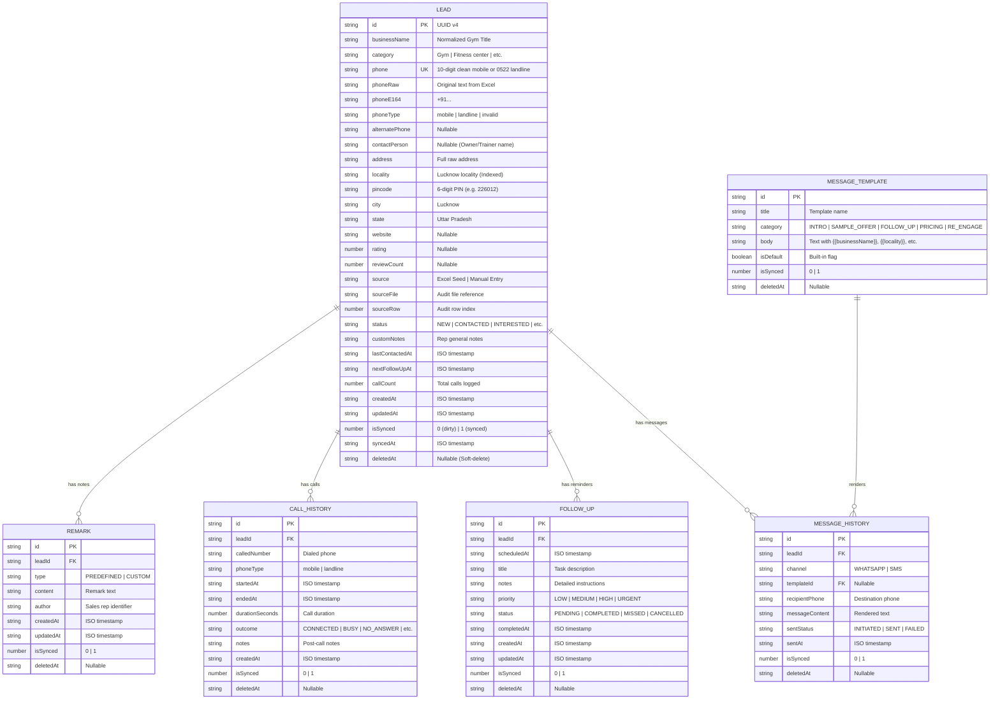

# Amaratv Krishi — Android-First Field Sales CRM
## Comprehensive Technical & Operational Documentation

---

## 1. Executive Summary & Project Purpose

**Amaratv Krishi Field Sales CRM** is an Android-first, offline-capable mobile CRM, calling workflow, and lead-management application designed specifically for Amaratv Krishi sales staff in Lucknow. The application empowers field sales representatives to contact gyms, fitness centres, and wellness centres across Lucknow, pitch Amaratv Krishi natural high-protein flour and nutrition blends, log call outcomes, capture sales remarks, share product catalogues over WhatsApp, schedule follow-ups with local push notifications, manage local JSON backups, and monitor their sales pipeline on a real-time dashboard.

### Brand Identity
* **Brand Name**: Amaratv Krishi
* **Tagline**: *From Our Fields to Your Home*
* **Core Objective**: Secure retail front-desk placement and bulk nutrition supply partnerships with fitness centres and gym owners in Lucknow.
* **Core Principle**: This application is **NOT an Excel viewer**. It is a full-fledged, offline-first mobile CRM and sales workflow engine seeded initially from Google Places crawler datasets.

---

## 2. Architecture & Technology Stack

```
┌─────────────────────────────────────────────────────────────────────────┐
│                           AMARATV KRISHI CRM                            │
├─────────────────────────────────────────────────────────────────────────┤
│  Presentation Layer: React 19 + TypeScript + Tailwind CSS 4             │
│  - Mobile-First 3-Tab Bottom Navigation: Home | Leads | Follow-ups     │
│  - Real-Time Sales KPI Dashboard with Clickable Pipeline Stages         │
│  - Dedicated Follow-ups Hub (Overdue, Today, Upcoming)                  │
│  - In-App Lead Profile with Multi-Tab Activity Feed (Calls/WA/Remarks)  │
│  - Hardware Back-Button Listener (Hierarchical Modal Dismissal)         │
│  - One-Hand Thumb Ergonomics (Prominent CALL & WHATSAPP Action Pairs)   │
├─────────────────────────────────────────────────────────────────────────┤
│  Native Android Bridge Layer: Capacitor 8 Android Shell                 │
│  - Native Phone Dialer Trigger (Intent.ACTION_DIAL)                     │
│  - App State Foreground/Background Lifecycle Listener (Outcome Prompt) │
│  - Android Native Share Intent (ACTION_SEND + FileProvider for PDFs)    │
│  - WhatsApp & WhatsApp Business Package Visibility Queries              │
│  - Local Push Notifications (@capacitor/local-notifications)            │
│  - Hardware Back-Button Event Integration (@capacitor/app)              │
├─────────────────────────────────────────────────────────────────────────┤
│  Local Storage Layer: IndexedDB via Dexie.js v4.4                       │
│  - 100% Offline Persistence in Android WebView / Browser                │
│  - Compound Indices ([status+deletedAt], [locality+deletedAt])          │
│  - Client-Side UUID v4 Primary Keys & Atomic Dirty Flags (isSynced)     │
├─────────────────────────────────────────────────────────────────────────┤
│  Ingestion, Sharing & Backup Engine: SheetJS + Template + BackupService │
│  - Auto-Column Header Matching & Normalization Rules                    │
│  - Indian Mobile (+91) vs Lucknow Landline (0522) Sanitization          │
│  - Safe Template Variable Renderer ({{tags}}) with Zero Raw Leakage     │
│  - 25MB Attachment Validator & Local File Metadata Formatter            │
│  - Versioned JSON Backup Export, LWW Merge Restore, Rollback Replace    │
└─────────────────────────────────────────────────────────────────────────┘
```

### Technology Breakdown
| Component | Technology | Role / Justification |
| :--- | :--- | :--- |
| **Frontend Framework** | React 19 + TypeScript | High-performance reactive UI, zero-lag local filtering. |
| **Styling & Design** | Tailwind CSS 4 | Mobile-first utility CSS, custom brand colors (Emerald/Earth). |
| **Icons** | Lucide React | Lightweight, crisp vector iconography. |
| **Local Database** | Dexie.js (IndexedDB) | ACID transactions, multi-index queries, offline persistence. |
| **Excel Parser** | SheetJS (`xlsx`) | Binary file reading, multi-sheet detection, data extraction. |
| **Android Packaging** | Capacitor 8 | Native Android Gradle project, native intents, APK readiness. |
| **Push Reminders** | `@capacitor/local-notifications` | Standalone local follow-up alarms on device without cloud dependencies. |
| **Document Sharing** | `@capacitor/share` + `FileProvider` | Safe local PDF catalogue & image sharing to WhatsApp. |
| **Hardware Back-Button** | `@capacitor/app` | Hierarchical modal dismissal preventing accidental app exits. |
| **Automated Device E2E** | TypeScript + ADB Driver | Automated on-device test runner (`npm run test:android`). |
| **Test Runner** | Vitest 4 + `fake-indexeddb` | High-speed automated unit and workflow test execution. |
| **Bundler** | Vite 8 | Instant HMR development and sub-second production builds. |

---

## 3. Database Architecture & Data Models

All entities use deterministic client-generated **UUID v4** strings as primary keys (`id`), making the database fully prepared for future bidirectional cloud sync without ID auto-increment collisions.

### 3.1. Entity Relationship Diagram



---

## 4. Verification & Test Summary

* **Unit & Integration Test Suites**: 8 test files, **99 passing tests (100% green in 1.42s)** (`npm test`).
* **Android On-Device E2E Suite**: 10 test modules, **10 passing tests (100% green in 20.73s)** (`npm run test:android`).
  * Tested on connected physical hardware: **vivo V2319** (Android 16, API 36, arm64-v8a).
  * 7 high-resolution screen captures stored in `e2e/android/screenshots/`.
  * Complete test reports in `e2e/android/reports/android-e2e-report.json` and `e2e/android/reports/android-e2e-report.md`.
* **Production Build**: `npm run build` succeeds cleanly in `<0.9s`.
* **Capacitor Sync**: `npx cap sync android` synchronizes in `<0.2s`.
* **Debug APK Compilation**: `./gradlew.bat assembleDebug` produces `app-debug.apk` (4.50 MB, 184 tasks).

---

## 5. Developer & Operational Commands

### Running Local Development Server
```bash
npm run dev
# Opens Vite development server at http://localhost:3000
```

### Running Vitest Regression Test Suite
```bash
npm test
# Runs all 99 Vitest unit & integration test suites
```

### Running Automated Android Device E2E Suite
```bash
npm run test:android
# Automatically detects connected Android device, installs APK, runs 10 on-device test modules, captures screenshots, and generates reports
```

### Running Android Device E2E Suite in Fresh Mode
```bash
npm run test:android:fresh
# Clears application data (pm clear) before executing device test run
```

### Building Production Web Bundle
```bash
npm run build
# Compiles TypeScript and builds optimized bundle into dist/
```

### Syncing with Android Project
```bash
npx cap sync android
# Copies dist/ assets, plugins, and configs into android/
```

### Compiling Native Android Debug APK
```bash
cd android
./gradlew.bat assembleDebug
# Generates app-debug.apk in android/app/build/outputs/apk/debug/
```

---

*Document updated: 2026-08-20 • Amaratv Krishi Field Sales CRM v1.0 • Release Decision: READY FOR PRODUCTION*
